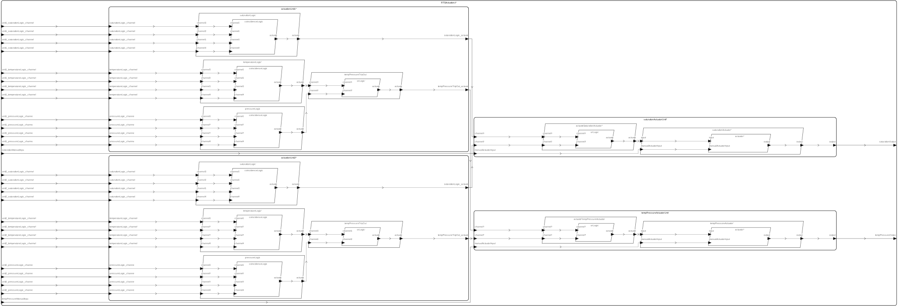

# <!--start__rts-title-->RTS<!--end____rts-title-->
<!--start__rts-description-->
The data, links, and images in this file are auto-generated from HAMR's report generation facility. Additional text explanations have been added for readability.
<!--end____rts-description-->
## <!--start__rts_arch-section-title-->AADL Architecture<!--end____rts_arch-section-title-->
<!--start__rts_arch-section-description-->


The following documentation blocks provide links to AADL textual representation source of the Thread components in the system.
* "Type" links to the AADL component type declaration (providing the port-based interface for the component)
* "Behavior Specification" (when present) links to the GUMBO behavior contract for the component. HAMR automatically
compiles the GUMBO contract to both an code-level contract used for Logika code verification as well as an executable
representation of the contract (as pure boolean functions) used in unit and system testing.
<!--end____rts_arch-section-description-->
<!--start__rts_arch-section_aadl-arch-component-info-rts_i_instance-->
|System: [RTS::RTS.i](aadl/packages/RTS.aadl#L35)|
|:--|
<!--end____rts_arch-section_aadl-arch-component-info-rts_i_instance-->
<!--start__rts_arch-section_aadl-arch-component-info-actuator-tpau_temppressa_actuator-->
|Thread: TPAU_tempPressA_actuator <!--[actuator](aadl/packages/Actuation.aadl#L240)--> |
|:--|
|Type: [Actuation::Actuator](aadl/packages/Actuation.aadl#L187)<br>Implementation: [Actuation::Actuator.i](aadl/packages/Actuation.aadl#L216)<br>Behavior Specification: [GUMBO](aadl/packages/Actuation.aadl#L202)|
|Periodic: 1000 ms|
|Domain: 14|

<!--end____rts_arch-section_aadl-arch-component-info-actuator-tpau_temppressa_actuator-->
<!--start__rts_arch-section_aadl-arch-component-info-actuator-sau_satactuator_actuator-->
|Thread: SAU_satActuator_actuator <!--[actuator](aadl/packages/Actuation.aadl#L240)--> |
|:--|
|Type: [Actuation::Actuator](aadl/packages/Actuation.aadl#L187)<br>Implementation: [Actuation::Actuator.i](aadl/packages/Actuation.aadl#L216)<br>Behavior Specification: [GUMBO](aadl/packages/Actuation.aadl#L202)|
|Periodic: 1000 ms|
|Domain: 16|

<!--end____rts_arch-section_aadl-arch-component-info-actuator-sau_satactuator_actuator-->
<!--start__rts_arch-section_aadl-arch-component-info-coincidencelogic-au1_temp_coincidencelogic-->
|Thread: au1_temp_coincidenceLogic <!--[coincidenceLogic](aadl/packages/Actuation.aadl#L86)--> |
|:--|
|Type: [Actuation::CoincidenceLogic](aadl/packages/Actuation.aadl#L22)<br>Implementation: [Actuation::CoincidenceLogic.i](aadl/packages/Actuation.aadl#L59)<br>Behavior Specification: [GUMBO](aadl/packages/Actuation.aadl#L40)|
|Periodic: 1000 ms|
|Domain: 5|

<!--end____rts_arch-section_aadl-arch-component-info-coincidencelogic-au1_temp_coincidencelogic-->
<!--start__rts_arch-section_aadl-arch-component-info-coincidencelogic-au1_press_coincidencelogic-->
|Thread: au1_press_coincidenceLogic <!--[coincidenceLogic](aadl/packages/Actuation.aadl#L86)--> |
|:--|
|Type: [Actuation::CoincidenceLogic](aadl/packages/Actuation.aadl#L22)<br>Implementation: [Actuation::CoincidenceLogic.i](aadl/packages/Actuation.aadl#L59)<br>Behavior Specification: [GUMBO](aadl/packages/Actuation.aadl#L40)|
|Periodic: 1000 ms|
|Domain: 6|

<!--end____rts_arch-section_aadl-arch-component-info-coincidencelogic-au1_press_coincidencelogic-->
<!--start__rts_arch-section_aadl-arch-component-info-coincidencelogic-au1_satlogic_coincidencelogic-->
|Thread: au1_satLogic_coincidenceLogic <!--[coincidenceLogic](aadl/packages/Actuation.aadl#L86)--> |
|:--|
|Type: [Actuation::CoincidenceLogic](aadl/packages/Actuation.aadl#L22)<br>Implementation: [Actuation::CoincidenceLogic.i](aadl/packages/Actuation.aadl#L59)<br>Behavior Specification: [GUMBO](aadl/packages/Actuation.aadl#L40)|
|Periodic: 1000 ms|
|Domain: 7|

<!--end____rts_arch-section_aadl-arch-component-info-coincidencelogic-au1_satlogic_coincidencelogic-->
<!--start__rts_arch-section_aadl-arch-component-info-coincidencelogic-au2_temp_coincidencelogic-->
|Thread: au2_temp_coincidenceLogic <!--[coincidenceLogic](aadl/packages/Actuation.aadl#L86)--> |
|:--|
|Type: [Actuation::CoincidenceLogic](aadl/packages/Actuation.aadl#L22)<br>Implementation: [Actuation::CoincidenceLogic.i](aadl/packages/Actuation.aadl#L59)<br>Behavior Specification: [GUMBO](aadl/packages/Actuation.aadl#L40)|
|Periodic: 1000 ms|
|Domain: 9|

<!--end____rts_arch-section_aadl-arch-component-info-coincidencelogic-au2_temp_coincidencelogic-->
<!--start__rts_arch-section_aadl-arch-component-info-coincidencelogic-au2_press_coincidencelogic-->
|Thread: au2_press_coincidenceLogic <!--[coincidenceLogic](aadl/packages/Actuation.aadl#L86)--> |
|:--|
|Type: [Actuation::CoincidenceLogic](aadl/packages/Actuation.aadl#L22)<br>Implementation: [Actuation::CoincidenceLogic.i](aadl/packages/Actuation.aadl#L59)<br>Behavior Specification: [GUMBO](aadl/packages/Actuation.aadl#L40)|
|Periodic: 1000 ms|
|Domain: 10|

<!--end____rts_arch-section_aadl-arch-component-info-coincidencelogic-au2_press_coincidencelogic-->
<!--start__rts_arch-section_aadl-arch-component-info-coincidencelogic-au2_sat_coincidencelogic-->
|Thread: au2_sat_coincidenceLogic <!--[coincidenceLogic](aadl/packages/Actuation.aadl#L86)--> |
|:--|
|Type: [Actuation::CoincidenceLogic](aadl/packages/Actuation.aadl#L22)<br>Implementation: [Actuation::CoincidenceLogic.i](aadl/packages/Actuation.aadl#L59)<br>Behavior Specification: [GUMBO](aadl/packages/Actuation.aadl#L40)|
|Periodic: 1000 ms|
|Domain: 11|

<!--end____rts_arch-section_aadl-arch-component-info-coincidencelogic-au2_sat_coincidencelogic-->
<!--start__rts_arch-section_aadl-arch-component-info-orlogic-au1_temppresstripout_orlogic-->
|Thread: au1_tempPressTripOut_orLogic <!--[orLogic](aadl/packages/Actuation.aadl#L152)--> |
|:--|
|Type: [Actuation::OrLogic](aadl/packages/Actuation.aadl#L101)<br>Implementation: [Actuation::OrLogic.i](aadl/packages/Actuation.aadl#L128)<br>Behavior Specification: [GUMBO](aadl/packages/Actuation.aadl#L119)|
|Periodic: 1000 ms|
|Domain: 8|

<!--end____rts_arch-section_aadl-arch-component-info-orlogic-au1_temppresstripout_orlogic-->
<!--start__rts_arch-section_aadl-arch-component-info-orlogic-au2_temppresstripout_orlogic-->
|Thread: au2_tempPressTripOut_orLogic <!--[orLogic](aadl/packages/Actuation.aadl#L152)--> |
|:--|
|Type: [Actuation::OrLogic](aadl/packages/Actuation.aadl#L101)<br>Implementation: [Actuation::OrLogic.i](aadl/packages/Actuation.aadl#L128)<br>Behavior Specification: [GUMBO](aadl/packages/Actuation.aadl#L119)|
|Periodic: 1000 ms|
|Domain: 12|

<!--end____rts_arch-section_aadl-arch-component-info-orlogic-au2_temppresstripout_orlogic-->
<!--start__rts_arch-section_aadl-arch-component-info-orlogic-tpau_acttemppa_orlogic-->
|Thread: TPAU_actTempPA_orLogic <!--[orLogic](aadl/packages/Actuation.aadl#L152)--> |
|:--|
|Type: [Actuation::OrLogic](aadl/packages/Actuation.aadl#L101)<br>Implementation: [Actuation::OrLogic.i](aadl/packages/Actuation.aadl#L128)<br>Behavior Specification: [GUMBO](aadl/packages/Actuation.aadl#L119)|
|Periodic: 1000 ms|
|Domain: 13|

<!--end____rts_arch-section_aadl-arch-component-info-orlogic-tpau_acttemppa_orlogic-->
<!--start__rts_arch-section_aadl-arch-component-info-orlogic-sau_actsatactuator_orlogic-->
|Thread: SAU_actSatActuator_orLogic <!--[orLogic](aadl/packages/Actuation.aadl#L152)--> |
|:--|
|Type: [Actuation::OrLogic](aadl/packages/Actuation.aadl#L101)<br>Implementation: [Actuation::OrLogic.i](aadl/packages/Actuation.aadl#L128)<br>Behavior Specification: [GUMBO](aadl/packages/Actuation.aadl#L119)|
|Periodic: 1000 ms|
|Domain: 15|

<!--end____rts_arch-section_aadl-arch-component-info-orlogic-sau_actsatactuator_orlogic-->
<!--start__rts_arch-section_aadl-arch-component-info-actuatorsmockthread-actuatorsmockthread-->
|Thread: actuatorsMockThread <!--[actuatorsMockThread](aadl/packages/Actuators.aadl#L48)--> |
|:--|
|Type: [Actuators::ActuatorsMockThread](aadl/packages/Actuators.aadl#L16)<br>Implementation: [Actuators::ActuatorsMockThread.i](aadl/packages/Actuators.aadl#L23)|
|Periodic: 1000 ms|
|Domain: 4|

<!--end____rts_arch-section_aadl-arch-component-info-actuatorsmockthread-actuatorsmockthread-->
<!--start__rts_arch-section_aadl-arch-component-info-eventcontrolmockthread-eventcontrolmockthread-->
|Thread: eventControlMockThread <!--[eventControlMockThread](aadl/packages/EventControl.aadl#L69)--> |
|:--|
|Type: [EventControl::EventControlMockThread](aadl/packages/EventControl.aadl#L16)<br>Implementation: [EventControl::EventControlMockThread.i](aadl/packages/EventControl.aadl#L37)|
|Periodic: 1000 ms|
|Domain: 3|

<!--end____rts_arch-section_aadl-arch-component-info-eventcontrolmockthread-eventcontrolmockthread-->
<!--start__rts_arch-section_aadl-arch-component-info-instrumentationmockthread-instrumentationmockthread-->
|Thread: instrumentationMockThread <!--[instrumentationMockThread](aadl/packages/Instrumentation.aadl#L195)--> |
|:--|
|Type: [Instrumentation::InstrumentationMockThread](aadl/packages/Instrumentation.aadl#L14)<br>Implementation: [Instrumentation::InstrumentationMockThread.i](aadl/packages/Instrumentation.aadl#L97)|
|Periodic: 1000 ms|
|Domain: 2|

<!--end____rts_arch-section_aadl-arch-component-info-instrumentationmockthread-instrumentationmockthread-->

## <!--start__rts_behavior-code-title-->Behavior Code<!--end____rts_behavior-code-title-->
<!--start__rts_behavior-code-description-->
The following items link to the Slang source code for the application logic of each thread.
In the HAMR development workflow, skeletons for these files are automatically created,
along with APIs for communicating over model-declared ports in the component type.
GUMBO component contracts in the AADL model are automatically translated to Slang/Logika
contracts and included in the generated skeletons. Then, the application developer uses a
conventional development approach for coding the application logic in Slang
(C workflows are also supported). Logika can be applied to verify that the user's
application code conforms to the generated Logika contracts (which are derived
automatically from model-level GUMBO contracts). The HAMR build framework will integrate
the user-code application logic for each component (below) with auto-generated threading
and communication infrastructure code, along with HAMR's implementation of AADL run-time
(based on AADL's standardized Run-Time Services). Note that HAMR is smart enough to
accomodate changes to model-level interface declarations (ports, etc.) as well as changes
to GUMBO contracts -- user code will not be clobbered when the model is changed and HAMR
code generation is rerun. Instead, HAMR uses specially designed delimiters in the
application code files to, e.g., re-weave updated contracts into the application code.

Executable Slang versions of the GUMBO contracts (referred to as "GUMBOX" contracts)
are also automatically generated in the code generation process. These executable
contracts are automatically integrated into the system testing process: appropriate
portions of the executable contracts are invoked in the pre-state and the post-state
of a thread dispatch to dynamically check that the thread's behavior for that particular
dispatch conforms to the model-level GUMBO contracts.
<!--end____rts_behavior-code-description-->
<!--start__rts_behavior-code_slang-code-instrumentationmockthread-instrumentationmockthread-->
[instrumentationMockThread](hamr/slang/src/main/component/RTS/Instrumentation/InstrumentationMockThread_i_instrumentationMock_instrumentationMockThread.scala)

<!--end____rts_behavior-code_slang-code-instrumentationmockthread-instrumentationmockthread-->
<!--start__rts_behavior-code_slang-code-eventcontrolmockthread-eventcontrolmockthread-->
[eventControlMockThread](hamr/slang/src/main/component/RTS/EventControl/EventControlMockThread_i_eventControlMock_eventControlMockThread.scala)

<!--end____rts_behavior-code_slang-code-eventcontrolmockthread-eventcontrolmockthread-->
<!--start__rts_behavior-code_slang-code-actuatorsmockthread-actuatorsmockthread-->
[actuatorsMockThread](hamr/slang/src/main/component/RTS/Actuators/ActuatorsMockThread_i_actuatorsMock_actuatorsMockThread.scala)

<!--end____rts_behavior-code_slang-code-actuatorsmockthread-actuatorsmockthread-->
<!--start__rts_behavior-code_slang-code-coincidencelogic-au1_temp_coincidencelogic-->
[au1_temp_coincidenceLogic](hamr/slang/src/main/component/RTS/Actuation/CoincidenceLogic_i_actuationSubsystem_actuationUnit1_temperatureLogic_coincidenceLogic.scala)
<br>[GumboX](hamr/slang/src/main/bridge/RTS/Actuation/CoincidenceLogic_i_actuationSubsystem_actuationUnit1_temperatureLogic_coincidenceLogic_GumboX.scala)
<!--end____rts_behavior-code_slang-code-coincidencelogic-au1_temp_coincidencelogic-->
<!--start__rts_behavior-code_slang-code-coincidencelogic-au1_press_coincidencelogic-->
[au1_press_coincidenceLogic](hamr/slang/src/main/component/RTS/Actuation/CoincidenceLogic_i_actuationSubsystem_actuationUnit1_pressureLogic_coincidenceLogic.scala)
<br>[GumboX](hamr/slang/src/main/bridge/RTS/Actuation/CoincidenceLogic_i_actuationSubsystem_actuationUnit1_pressureLogic_coincidenceLogic_GumboX.scala)
<!--end____rts_behavior-code_slang-code-coincidencelogic-au1_press_coincidencelogic-->
<!--start__rts_behavior-code_slang-code-coincidencelogic-au1_satlogic_coincidencelogic-->
[au1_satLogic_coincidenceLogic](hamr/slang/src/main/component/RTS/Actuation/CoincidenceLogic_i_actuationSubsystem_actuationUnit1_saturationLogic_coincidenceLogic.scala)
<br>[GumboX](hamr/slang/src/main/bridge/RTS/Actuation/CoincidenceLogic_i_actuationSubsystem_actuationUnit1_saturationLogic_coincidenceLogic_GumboX.scala)
<!--end____rts_behavior-code_slang-code-coincidencelogic-au1_satlogic_coincidencelogic-->
<!--start__rts_behavior-code_slang-code-orlogic-au1_temppresstripout_orlogic-->
[au1_tempPressTripOut_orLogic](hamr/slang/src/main/component/RTS/Actuation/OrLogic_i_actuationSubsystem_actuationUnit1_tempPressureTripOut_orLogic.scala)
<br>[GumboX](hamr/slang/src/main/bridge/RTS/Actuation/OrLogic_i_actuationSubsystem_actuationUnit1_tempPressureTripOut_orLogic_GumboX.scala)
<!--end____rts_behavior-code_slang-code-orlogic-au1_temppresstripout_orlogic-->
<!--start__rts_behavior-code_slang-code-coincidencelogic-au2_temp_coincidencelogic-->
[au2_temp_coincidenceLogic](hamr/slang/src/main/component/RTS/Actuation/CoincidenceLogic_i_actuationSubsystem_actuationUnit2_temperatureLogic_coincidenceLogic.scala)
<br>[GumboX](hamr/slang/src/main/bridge/RTS/Actuation/CoincidenceLogic_i_actuationSubsystem_actuationUnit2_temperatureLogic_coincidenceLogic_GumboX.scala)
<!--end____rts_behavior-code_slang-code-coincidencelogic-au2_temp_coincidencelogic-->
<!--start__rts_behavior-code_slang-code-coincidencelogic-au2_press_coincidencelogic-->
[au2_press_coincidenceLogic](hamr/slang/src/main/component/RTS/Actuation/CoincidenceLogic_i_actuationSubsystem_actuationUnit2_pressureLogic_coincidenceLogic.scala)
<br>[GumboX](hamr/slang/src/main/bridge/RTS/Actuation/CoincidenceLogic_i_actuationSubsystem_actuationUnit2_pressureLogic_coincidenceLogic_GumboX.scala)
<!--end____rts_behavior-code_slang-code-coincidencelogic-au2_press_coincidencelogic-->
<!--start__rts_behavior-code_slang-code-coincidencelogic-au2_sat_coincidencelogic-->
[au2_sat_coincidenceLogic](hamr/slang/src/main/component/RTS/Actuation/CoincidenceLogic_i_actuationSubsystem_actuationUnit2_saturationLogic_coincidenceLogic.scala)
<br>[GumboX](hamr/slang/src/main/bridge/RTS/Actuation/CoincidenceLogic_i_actuationSubsystem_actuationUnit2_saturationLogic_coincidenceLogic_GumboX.scala)
<!--end____rts_behavior-code_slang-code-coincidencelogic-au2_sat_coincidencelogic-->
<!--start__rts_behavior-code_slang-code-orlogic-au2_temppresstripout_orlogic-->
[au2_tempPressTripOut_orLogic](hamr/slang/src/main/component/RTS/Actuation/OrLogic_i_actuationSubsystem_actuationUnit2_tempPressureTripOut_orLogic.scala)
<br>[GumboX](hamr/slang/src/main/bridge/RTS/Actuation/OrLogic_i_actuationSubsystem_actuationUnit2_tempPressureTripOut_orLogic_GumboX.scala)
<!--end____rts_behavior-code_slang-code-orlogic-au2_temppresstripout_orlogic-->
<!--start__rts_behavior-code_slang-code-orlogic-tpau_acttemppa_orlogic-->
[TPAU_actTempPA_orLogic](hamr/slang/src/main/component/RTS/Actuation/OrLogic_i_actuationSubsystem_tempPressureActuatorUnit_actuateTempPressureActuator_orLogic.scala)
<br>[GumboX](hamr/slang/src/main/bridge/RTS/Actuation/OrLogic_i_actuationSubsystem_tempPressureActuatorUnit_actuateTempPressureActuator_orLogic_GumboX.scala)
<!--end____rts_behavior-code_slang-code-orlogic-tpau_acttemppa_orlogic-->
<!--start__rts_behavior-code_slang-code-actuator-tpau_temppressa_actuator-->
[TPAU_tempPressA_actuator](hamr/slang/src/main/component/RTS/Actuation/Actuator_i_actuationSubsystem_tempPressureActuatorUnit_tempPressureActuator_actuator.scala)
<br>[GumboX](hamr/slang/src/main/bridge/RTS/Actuation/Actuator_i_actuationSubsystem_tempPressureActuatorUnit_tempPressureActuator_actuator_GumboX.scala)
<!--end____rts_behavior-code_slang-code-actuator-tpau_temppressa_actuator-->
<!--start__rts_behavior-code_slang-code-orlogic-sau_actsatactuator_orlogic-->
[SAU_actSatActuator_orLogic](hamr/slang/src/main/component/RTS/Actuation/OrLogic_i_actuationSubsystem_saturationActuatorUnit_actuateSaturationActuator_orLogic.scala)
<br>[GumboX](hamr/slang/src/main/bridge/RTS/Actuation/OrLogic_i_actuationSubsystem_saturationActuatorUnit_actuateSaturationActuator_orLogic_GumboX.scala)
<!--end____rts_behavior-code_slang-code-orlogic-sau_actsatactuator_orlogic-->
<!--start__rts_behavior-code_slang-code-actuator-sau_satactuator_actuator-->
[SAU_satActuator_actuator](hamr/slang/src/main/component/RTS/Actuation/Actuator_i_actuationSubsystem_saturationActuatorUnit_saturationActuator_actuator.scala)
<br>[GumboX](hamr/slang/src/main/bridge/RTS/Actuation/Actuator_i_actuationSubsystem_saturationActuatorUnit_saturationActuator_actuator_GumboX.scala)
<!--end____rts_behavior-code_slang-code-actuator-sau_satactuator_actuator-->

## <!--start__rts_metrics-title-->Metrics<!--end____rts_metrics-title-->
<!--start__rts_metrics-description-->
<!--end____rts_metrics-description-->
### <!--start__rts_metrics_aadl-metrics-title-->AADL Metrics<!--end____rts_metrics_aadl-metrics-title-->
<!--start__rts_metrics_aadl-metrics-description-->
The following section provides statistics about the AADL model to give a rough idea of
its size (in terms of number of AADL modeling elements that impact the size of the deployed system).
<!--end____rts_metrics_aadl-metrics-description-->
<!--start__rts_metrics_aadl-metrics_aadl-metrics-content-block-->
| | |
|:--|:--|
|Threads|15|
|Ports|76|
|Connections|38|
<!--end____rts_metrics_aadl-metrics_aadl-metrics-content-block-->

### <!--start__rts_metrics_jvm-metrics-title-->JVM Metrics<!--end____rts_metrics_jvm-metrics-title-->
<!--start__rts_metrics_jvm-metrics-description-->
The following section provides statistics about the Slang source code.
<!--end____rts_metrics_jvm-metrics-description-->
<!--start__rts_metrics_jvm-metrics_rts_code_metrics-->
Directories Scanned Using [https://github.com/AlDanial/cloc](https://github.com/AlDanial/cloc) v1.94:
- [hamr/slang/src/main](hamr/slang/src/main)

<u><b>Total LOC</b></u>

Total number of HAMR-generated and developer-written lines of code
Language|files|blank|comment|code
:-------|-------:|-------:|-------:|-------:
Scala|147|5720|2738|26542
--------|--------|--------|--------|--------
SUM:|147|5720|2738|26542

<u><b>User LOC</b></u>

The number of lines of code written by the developer.
"Log" are lines of code used for logging that
likely would be excluded in a release build
 |Type|code |
 |:--|--:|
 |Behavior|156|
 |Log|6|
 |--------|--------|
 |SUM:|162|
<!--end____rts_metrics_jvm-metrics_rts_code_metrics-->

## <!--start__rts_system-testing-setup-title-->System Testing<!--end____rts_system-testing-setup-title-->
<!--start__rts_system-testing-setup-description-->
<!--end____rts_system-testing-setup-description-->
### <!--start__rts_system-testing-setup_configurations-title-->Test Run Configurations<!--end____rts_system-testing-setup_configurations-title-->
<!--start__rts_system-testing-setup_configurations-description-->
All configurations use the following static schedule provided by [CustStaticSchedule.scala](hamr/slang/src/main/component/RTS/CustStaticSchedule.scala)

- [instrumentationMockThread](hamr/slang/src/main/component/RTS/Instrumentation/InstrumentationMockThread_i_instrumentationMock_instrumentationMockThread.scala), [eventControlMockThread](hamr/slang/src/main/component/RTS/EventControl/EventControlMockThread_i_eventControlMock_eventControlMockThread.scala), [au1_temp_coincidenceLogic](hamr/slang/src/main/component/RTS/Actuation/CoincidenceLogic_i_actuationSubsystem_actuationUnit1_temperatureLogic_coincidenceLogic.scala), [au1_press_coincidenceLogic](hamr/slang/src/main/component/RTS/Actuation/CoincidenceLogic_i_actuationSubsystem_actuationUnit1_pressureLogic_coincidenceLogic.scala), [au1_satLogic_coincidenceLogic](hamr/slang/src/main/component/RTS/Actuation/CoincidenceLogic_i_actuationSubsystem_actuationUnit1_saturationLogic_coincidenceLogic.scala), [au1_tempPressTripOut_orLogic](hamr/slang/src/main/component/RTS/Actuation/OrLogic_i_actuationSubsystem_actuationUnit1_tempPressureTripOut_orLogic.scala), [au2_temp_coincidenceLogic](hamr/slang/src/main/component/RTS/Actuation/CoincidenceLogic_i_actuationSubsystem_actuationUnit2_temperatureLogic_coincidenceLogic.scala), [au2_press_coincidenceLogic](hamr/slang/src/main/component/RTS/Actuation/CoincidenceLogic_i_actuationSubsystem_actuationUnit2_pressureLogic_coincidenceLogic.scala), [au2_sat_coincidenceLogic](hamr/slang/src/main/component/RTS/Actuation/CoincidenceLogic_i_actuationSubsystem_actuationUnit2_saturationLogic_coincidenceLogic.scala), [au2_tempPressTripOut_orLogic](hamr/slang/src/main/component/RTS/Actuation/OrLogic_i_actuationSubsystem_actuationUnit2_tempPressureTripOut_orLogic.scala), [TPAU_actTempPA_orLogic](hamr/slang/src/main/component/RTS/Actuation/OrLogic_i_actuationSubsystem_tempPressureActuatorUnit_actuateTempPressureActuator_orLogic.scala), [TPAU_tempPressA_actuator](hamr/slang/src/main/component/RTS/Actuation/Actuator_i_actuationSubsystem_tempPressureActuatorUnit_tempPressureActuator_actuator.scala), [SAU_actSatActuator_orLogic](hamr/slang/src/main/component/RTS/Actuation/OrLogic_i_actuationSubsystem_saturationActuatorUnit_actuateSaturationActuator_orLogic.scala), [SAU_satActuator_actuator](hamr/slang/src/main/component/RTS/Actuation/Actuator_i_actuationSubsystem_saturationActuatorUnit_saturationActuator_actuator.scala), [actuatorsMockThread](hamr/slang/src/main/component/RTS/Actuators/ActuatorsMockThread_i_actuatorsMock_actuatorsMockThread.scala)
<!--end____rts_system-testing-setup_configurations-description-->
#### <!--start__rts_system-testing-setup_configurations_actuation_subsystem_dsc_test_harness_configurations-title-->Configurations for Actuation_Subsystem_DSC_Test_Harness<!--end____rts_system-testing-setup_configurations_actuation_subsystem_dsc_test_harness_configurations-title-->
<!--start__rts_system-testing-setup_configurations_actuation_subsystem_dsc_test_harness_configurations-description-->
<!--end____rts_system-testing-setup_configurations_actuation_subsystem_dsc_test_harness_configurations-description-->
<!--start__rts_system-testing-setup_configurations_actuation_subsystem_dsc_test_harness_configurations_actuation_subsystem_dsc_test_harness_temppress_manual_trip_configuration_content-->
<table>
<tr><th colspan=2 align="left"><a href="hamr/slang/src/test/system/RTS/system_tests/rts1/Actuation_Subsystem_Test_wSlangCheck.scala#L93">TempPress_Manual_Trip</a></th>
</tr><tr>
<td>Description:</td><td>TempPress Manual Trip</td>
</tr><tr>
<td>Script Schema:</td><td><a href="hamr/slang/src/test/system/RTS/system_tests/rts1/Actuation_Subsystem_Test_wSlangCheck.scala#L310">Actuation_Subsystem_1HP_script_schema</a></td>
</tr><tr>
<td>Property:</td><td><a href="hamr/slang/src/test/system/RTS/system_tests/rts1/Actuation_Subsystem_Test_wSlangCheck.scala#L437">sysProp_TempPressManualTrip</a></td>
</tr><tr>
<td>Randomization Profile:</td><td>getDefaultProfile, <i>i.e. uses default configurations as provided by SlangCheck</i></td>
</tr><tr>
<td>Random Vector Filter:</td><td><a href="hamr/slang/src/test/system/RTS/system_tests/rts1/Actuation_Subsystem_Test_wSlangCheck.scala#L253)">examplePreStateContainerFilter</a></td>
</tr><tr>
<td>Relevant Coverage:</td><td></td>
</tr>
</table>

<!--end____rts_system-testing-setup_configurations_actuation_subsystem_dsc_test_harness_configurations_actuation_subsystem_dsc_test_harness_temppress_manual_trip_configuration_content-->
<!--start__rts_system-testing-setup_configurations_actuation_subsystem_dsc_test_harness_configurations_actuation_subsystem_dsc_test_harness_saturation_manual_trip_configuration_content-->
<table>
<tr><th colspan=2 align="left"><a href="hamr/slang/src/test/system/RTS/system_tests/rts1/Actuation_Subsystem_Test_wSlangCheck.scala#L102">Saturation_Manual_Trip</a></th>
</tr><tr>
<td>Description:</td><td>Saturation Manual Trip</td>
</tr><tr>
<td>Script Schema:</td><td><a href="hamr/slang/src/test/system/RTS/system_tests/rts1/Actuation_Subsystem_Test_wSlangCheck.scala#L310">Actuation_Subsystem_1HP_script_schema</a></td>
</tr><tr>
<td>Property:</td><td><a href="hamr/slang/src/test/system/RTS/system_tests/rts1/Actuation_Subsystem_Test_wSlangCheck.scala#L453">sysProp_SaturationManualTrip</a></td>
</tr><tr>
<td>Randomization Profile:</td><td>getDefaultProfile, <i>i.e. uses default configurations as provided by SlangCheck</i></td>
</tr><tr>
<td>Random Vector Filter:</td><td><a href="hamr/slang/src/test/system/RTS/system_tests/rts1/Actuation_Subsystem_Test_wSlangCheck.scala#L253)">examplePreStateContainerFilter</a></td>
</tr><tr>
<td>Relevant Coverage:</td><td></td>
</tr>
</table>

<!--end____rts_system-testing-setup_configurations_actuation_subsystem_dsc_test_harness_configurations_actuation_subsystem_dsc_test_harness_saturation_manual_trip_configuration_content-->
<!--start__rts_system-testing-setup_configurations_actuation_subsystem_dsc_test_harness_configurations_actuation_subsystem_dsc_test_harness_au1temptrip_configuration_content-->
<table>
<tr><th colspan=2 align="left"><a href="hamr/slang/src/test/system/RTS/system_tests/rts1/Actuation_Subsystem_Test_wSlangCheck.scala#L114">AU1TempTrip</a></th>
</tr><tr>
<td>Description:</td><td>AU1TempTrip</td>
</tr><tr>
<td>Script Schema:</td><td><a href="hamr/slang/src/test/system/RTS/system_tests/rts1/Actuation_Subsystem_Test_wSlangCheck.scala#L310">Actuation_Subsystem_1HP_script_schema</a></td>
</tr><tr>
<td>Property:</td><td><a href="hamr/slang/src/test/system/RTS/system_tests/rts1/Actuation_Subsystem_Test_wSlangCheck.scala#L471">sysProp_AU1TempTrip</a></td>
</tr><tr>
<td>Randomization Profile:</td><td>getDefaultProfile, <i>i.e. uses default configurations as provided by SlangCheck</i></td>
</tr><tr>
<td>Random Vector Filter:</td><td><a href="hamr/slang/src/test/system/RTS/system_tests/rts1/Actuation_Subsystem_Test_wSlangCheck.scala#L253)">examplePreStateContainerFilter</a></td>
</tr><tr>
<td>Relevant Coverage:</td><td></td>
</tr>
</table>

<!--end____rts_system-testing-setup_configurations_actuation_subsystem_dsc_test_harness_configurations_actuation_subsystem_dsc_test_harness_au1temptrip_configuration_content-->
<!--start__rts_system-testing-setup_configurations_actuation_subsystem_dsc_test_harness_configurations_actuation_subsystem_dsc_test_harness_au1presstrip_configuration_content-->
<table>
<tr><th colspan=2 align="left"><a href="hamr/slang/src/test/system/RTS/system_tests/rts1/Actuation_Subsystem_Test_wSlangCheck.scala#L123">AU1PressTrip</a></th>
</tr><tr>
<td>Description:</td><td>AU1PressTrip</td>
</tr><tr>
<td>Script Schema:</td><td><a href="hamr/slang/src/test/system/RTS/system_tests/rts1/Actuation_Subsystem_Test_wSlangCheck.scala#L310">Actuation_Subsystem_1HP_script_schema</a></td>
</tr><tr>
<td>Property:</td><td><a href="hamr/slang/src/test/system/RTS/system_tests/rts1/Actuation_Subsystem_Test_wSlangCheck.scala#L484">sysProp_AU1PressTrip</a></td>
</tr><tr>
<td>Randomization Profile:</td><td>getDefaultProfile, <i>i.e. uses default configurations as provided by SlangCheck</i></td>
</tr><tr>
<td>Random Vector Filter:</td><td><a href="hamr/slang/src/test/system/RTS/system_tests/rts1/Actuation_Subsystem_Test_wSlangCheck.scala#L253)">examplePreStateContainerFilter</a></td>
</tr><tr>
<td>Relevant Coverage:</td><td></td>
</tr>
</table>

<!--end____rts_system-testing-setup_configurations_actuation_subsystem_dsc_test_harness_configurations_actuation_subsystem_dsc_test_harness_au1presstrip_configuration_content-->
<!--start__rts_system-testing-setup_configurations_actuation_subsystem_dsc_test_harness_configurations_actuation_subsystem_dsc_test_harness_au1sattrip_configuration_content-->
<table>
<tr><th colspan=2 align="left"><a href="hamr/slang/src/test/system/RTS/system_tests/rts1/Actuation_Subsystem_Test_wSlangCheck.scala#L132">AU1SatTrip</a></th>
</tr><tr>
<td>Description:</td><td>AU1SatTrip</td>
</tr><tr>
<td>Script Schema:</td><td><a href="hamr/slang/src/test/system/RTS/system_tests/rts1/Actuation_Subsystem_Test_wSlangCheck.scala#L310">Actuation_Subsystem_1HP_script_schema</a></td>
</tr><tr>
<td>Property:</td><td><a href="hamr/slang/src/test/system/RTS/system_tests/rts1/Actuation_Subsystem_Test_wSlangCheck.scala#L497">sysProp_AU1SatTrip</a></td>
</tr><tr>
<td>Randomization Profile:</td><td>getDefaultProfile, <i>i.e. uses default configurations as provided by SlangCheck</i></td>
</tr><tr>
<td>Random Vector Filter:</td><td><a href="hamr/slang/src/test/system/RTS/system_tests/rts1/Actuation_Subsystem_Test_wSlangCheck.scala#L253)">examplePreStateContainerFilter</a></td>
</tr><tr>
<td>Relevant Coverage:</td><td></td>
</tr>
</table>

<!--end____rts_system-testing-setup_configurations_actuation_subsystem_dsc_test_harness_configurations_actuation_subsystem_dsc_test_harness_au1sattrip_configuration_content-->
<!--start__rts_system-testing-setup_configurations_actuation_subsystem_dsc_test_harness_configurations_actuation_subsystem_dsc_test_harness_au2temptrip_configuration_content-->
<table>
<tr><th colspan=2 align="left"><a href="hamr/slang/src/test/system/RTS/system_tests/rts1/Actuation_Subsystem_Test_wSlangCheck.scala#L144">AU2TempTrip</a></th>
</tr><tr>
<td>Description:</td><td>AU2TempTrip</td>
</tr><tr>
<td>Script Schema:</td><td><a href="hamr/slang/src/test/system/RTS/system_tests/rts1/Actuation_Subsystem_Test_wSlangCheck.scala#L310">Actuation_Subsystem_1HP_script_schema</a></td>
</tr><tr>
<td>Property:</td><td><a href="hamr/slang/src/test/system/RTS/system_tests/rts1/Actuation_Subsystem_Test_wSlangCheck.scala#L513">sysProp_AU2TempTrip</a></td>
</tr><tr>
<td>Randomization Profile:</td><td>getDefaultProfile, <i>i.e. uses default configurations as provided by SlangCheck</i></td>
</tr><tr>
<td>Random Vector Filter:</td><td><a href="hamr/slang/src/test/system/RTS/system_tests/rts1/Actuation_Subsystem_Test_wSlangCheck.scala#L253)">examplePreStateContainerFilter</a></td>
</tr><tr>
<td>Relevant Coverage:</td><td></td>
</tr>
</table>

<!--end____rts_system-testing-setup_configurations_actuation_subsystem_dsc_test_harness_configurations_actuation_subsystem_dsc_test_harness_au2temptrip_configuration_content-->
<!--start__rts_system-testing-setup_configurations_actuation_subsystem_dsc_test_harness_configurations_actuation_subsystem_dsc_test_harness_au2presstrip_configuration_content-->
<table>
<tr><th colspan=2 align="left"><a href="hamr/slang/src/test/system/RTS/system_tests/rts1/Actuation_Subsystem_Test_wSlangCheck.scala#L153">AU2PressTrip</a></th>
</tr><tr>
<td>Description:</td><td>AU2PressTrip</td>
</tr><tr>
<td>Script Schema:</td><td><a href="hamr/slang/src/test/system/RTS/system_tests/rts1/Actuation_Subsystem_Test_wSlangCheck.scala#L310">Actuation_Subsystem_1HP_script_schema</a></td>
</tr><tr>
<td>Property:</td><td><a href="hamr/slang/src/test/system/RTS/system_tests/rts1/Actuation_Subsystem_Test_wSlangCheck.scala#L526">sysProp_AU2PressTrip</a></td>
</tr><tr>
<td>Randomization Profile:</td><td>getDefaultProfile, <i>i.e. uses default configurations as provided by SlangCheck</i></td>
</tr><tr>
<td>Random Vector Filter:</td><td><a href="hamr/slang/src/test/system/RTS/system_tests/rts1/Actuation_Subsystem_Test_wSlangCheck.scala#L253)">examplePreStateContainerFilter</a></td>
</tr><tr>
<td>Relevant Coverage:</td><td></td>
</tr>
</table>

<!--end____rts_system-testing-setup_configurations_actuation_subsystem_dsc_test_harness_configurations_actuation_subsystem_dsc_test_harness_au2presstrip_configuration_content-->
<!--start__rts_system-testing-setup_configurations_actuation_subsystem_dsc_test_harness_configurations_actuation_subsystem_dsc_test_harness_au2sattrip_configuration_content-->
<table>
<tr><th colspan=2 align="left"><a href="hamr/slang/src/test/system/RTS/system_tests/rts1/Actuation_Subsystem_Test_wSlangCheck.scala#L162">AU2SatTrip</a></th>
</tr><tr>
<td>Description:</td><td>AU2SatTrip</td>
</tr><tr>
<td>Script Schema:</td><td><a href="hamr/slang/src/test/system/RTS/system_tests/rts1/Actuation_Subsystem_Test_wSlangCheck.scala#L310">Actuation_Subsystem_1HP_script_schema</a></td>
</tr><tr>
<td>Property:</td><td><a href="hamr/slang/src/test/system/RTS/system_tests/rts1/Actuation_Subsystem_Test_wSlangCheck.scala#L539">sysProp_AU2SatTrip</a></td>
</tr><tr>
<td>Randomization Profile:</td><td>getDefaultProfile, <i>i.e. uses default configurations as provided by SlangCheck</i></td>
</tr><tr>
<td>Random Vector Filter:</td><td><a href="hamr/slang/src/test/system/RTS/system_tests/rts1/Actuation_Subsystem_Test_wSlangCheck.scala#L253)">examplePreStateContainerFilter</a></td>
</tr><tr>
<td>Relevant Coverage:</td><td></td>
</tr>
</table>

<!--end____rts_system-testing-setup_configurations_actuation_subsystem_dsc_test_harness_configurations_actuation_subsystem_dsc_test_harness_au2sattrip_configuration_content-->
<!--start__rts_system-testing-setup_configurations_actuation_subsystem_dsc_test_harness_configurations_actuation_subsystem_dsc_test_harness_temppresstripcausality_configuration_content-->
<table>
<tr><th colspan=2 align="left"><a href="hamr/slang/src/test/system/RTS/system_tests/rts1/Actuation_Subsystem_Test_wSlangCheck.scala#L174">TempPressTripCausality</a></th>
</tr><tr>
<td>Description:</td><td>TempPressTripCausality</td>
</tr><tr>
<td>Script Schema:</td><td><a href="hamr/slang/src/test/system/RTS/system_tests/rts1/Actuation_Subsystem_Test_wSlangCheck.scala#L310">Actuation_Subsystem_1HP_script_schema</a></td>
</tr><tr>
<td>Property:</td><td><a href="hamr/slang/src/test/system/RTS/system_tests/rts1/Actuation_Subsystem_Test_wSlangCheck.scala#L571">sysProp_TempPressTripCausality</a></td>
</tr><tr>
<td>Randomization Profile:</td><td>getDefaultProfile, <i>i.e. uses default configurations as provided by SlangCheck</i></td>
</tr><tr>
<td>Random Vector Filter:</td><td><a href="hamr/slang/src/test/system/RTS/system_tests/rts1/Actuation_Subsystem_Test_wSlangCheck.scala#L253)">examplePreStateContainerFilter</a></td>
</tr><tr>
<td>Relevant Coverage:</td><td></td>
</tr>
</table>

<!--end____rts_system-testing-setup_configurations_actuation_subsystem_dsc_test_harness_configurations_actuation_subsystem_dsc_test_harness_temppresstripcausality_configuration_content-->
<!--start__rts_system-testing-setup_configurations_actuation_subsystem_dsc_test_harness_configurations_actuation_subsystem_dsc_test_harness_sattripcausality_configuration_content-->
<table>
<tr><th colspan=2 align="left"><a href="hamr/slang/src/test/system/RTS/system_tests/rts1/Actuation_Subsystem_Test_wSlangCheck.scala#L183">SatTripCausality</a></th>
</tr><tr>
<td>Description:</td><td>SatTripCausality</td>
</tr><tr>
<td>Script Schema:</td><td><a href="hamr/slang/src/test/system/RTS/system_tests/rts1/Actuation_Subsystem_Test_wSlangCheck.scala#L310">Actuation_Subsystem_1HP_script_schema</a></td>
</tr><tr>
<td>Property:</td><td><a href="hamr/slang/src/test/system/RTS/system_tests/rts1/Actuation_Subsystem_Test_wSlangCheck.scala#L555">sysProp_SatTripCausality</a></td>
</tr><tr>
<td>Randomization Profile:</td><td>getDefaultProfile, <i>i.e. uses default configurations as provided by SlangCheck</i></td>
</tr><tr>
<td>Random Vector Filter:</td><td><a href="hamr/slang/src/test/system/RTS/system_tests/rts1/Actuation_Subsystem_Test_wSlangCheck.scala#L253)">examplePreStateContainerFilter</a></td>
</tr><tr>
<td>Relevant Coverage:</td><td></td>
</tr>
</table>

<!--end____rts_system-testing-setup_configurations_actuation_subsystem_dsc_test_harness_configurations_actuation_subsystem_dsc_test_harness_sattripcausality_configuration_content-->
<!--start__rts_system-testing-setup_configurations_actuation_subsystem_dsc_test_harness_configurations_actuation_subsystem_dsc_test_harness_alu_satisfies_oracle_configuration_content-->
<table>
<tr><th colspan=2 align="left"><a href="hamr/slang/src/test/system/RTS/system_tests/rts1/Actuation_Subsystem_Test_wSlangCheck.scala#L195">ALU_Satisfies_Oracle</a></th>
</tr><tr>
<td>Description:</td><td>ALU Satisfies Oracle</td>
</tr><tr>
<td>Script Schema:</td><td><a href="hamr/slang/src/test/system/RTS/system_tests/rts1/Actuation_Subsystem_Test_wSlangCheck.scala#L310">Actuation_Subsystem_1HP_script_schema</a></td>
</tr><tr>
<td>Property:</td><td><a href="hamr/slang/src/test/system/RTS/system_tests/rts1/Actuation_Subsystem_Test_wSlangCheck.scala#L595">sysProp_ALU_Satisfies_Functional_Oracle</a></td>
</tr><tr>
<td>Randomization Profile:</td><td>getDefaultProfile, <i>i.e. uses default configurations as provided by SlangCheck</i></td>
</tr><tr>
<td>Random Vector Filter:</td><td><a href="hamr/slang/src/test/system/RTS/system_tests/rts1/Actuation_Subsystem_Test_wSlangCheck.scala#L253)">examplePreStateContainerFilter</a></td>
</tr><tr>
<td>Relevant Coverage:</td><td></td>
</tr>
</table>

<!--end____rts_system-testing-setup_configurations_actuation_subsystem_dsc_test_harness_configurations_actuation_subsystem_dsc_test_harness_alu_satisfies_oracle_configuration_content-->

## <!--start__rts_how-to-run-title-->How to Run<!--end____rts_how-to-run-title-->
<!--start__rts_how-to-run-description-->
System testing requires a Sireum distribution. Instructions on how to obtain a
distribution are available at [https://sireum.org/getting-started/](https://sireum.org/getting-started/).
The rest of this documentation assumes the ``SIREUM_HOME`` environmental variable has been set and that
sireum's bin directory has been added to your path (e.g. for Linux/MacOS ``export PATH=$SIREUM_HOME/bin:$PATH``
or Windows ``set PATH=%PATH%\bin;%PATH%``


<!--end____rts_how-to-run-description-->
### <!--start__rts_how-to-run_framework-generation-title-->Framework Generation<!--end____rts_how-to-run_framework-generation-title-->
<!--start__rts_how-to-run_framework-generation-description-->
1. Build the System Testing Artifact Generator following the instructions at
   [SystemTestArtifactGen/readme.md](../report/util/SystemTestArtifactGen/readme.md)
1. Run the generator by passing it the paths to one or more files that contain
   input/output container definitions

For example, running the generator on
[Containers.scala](hamr/slang/src/main/util/RTS/system_tests/rts1/Containers.scala)
will generate the following artifacts:

1. [Example_Actuation_Subsystem_Inputs_Container_Test_wSlangCheck.scala](hamr/slang/src/test/system/RTS/system_tests/rts1/Example_Actuation_Subsystem_Inputs_Container_Test_wSlangCheck.scala)

   System test suite containing an example test run configuration.  Developers can make a copy of this file and then define
   custom test run configurations where each configuration has the structure
   _(script schema, property, randomization profile, random vector filter)_

1. [Example_Actuation_Subsystem_Inputs_Container_DSC_Test_Harness.scala](hamr/slang/src/test/system/RTS/system_tests/rts1/Example_Actuation_Subsystem_Inputs_Container_DSC_Test_Harness.scala)

      Example showing how a system test suite can be adapted for use with Distributed SlangCheck (DSC). It overrides/implements
   two DCS methods, ``next`` and ``test``.  The next method is called during DSC's test vector generation phase. The generated
   vectors are subsequently passed to the test method during DSC's testing phase. Both methods use the environment variable
   ``DSC_TEST_FAMILY_NAME`` to determine which test run configuration should be used.


<!--end____rts_how-to-run_framework-generation-description-->

### <!--start__rts_how-to-run_manual-testing-title-->Manual System Testing<!--end____rts_how-to-run_manual-testing-title-->
<!--start__rts_how-to-run_manual-testing-description-->
The example system test suites described previously were used to write
system tests for the Actuator subsystem as follows:
<!--end____rts_how-to-run_manual-testing-description-->
<!--start__rts_how-to-run_manual-testing_actuator-subsystem_block-->
__Actuator subsystem__

  System Test Suite Class: [Actuation_Subsystem_Test_wSlangCheck.scala](hamr/slang/src/test/system/RTS/system_tests/rts1/Actuation_Subsystem_Test_wSlangCheck.scala)

  Test run configurations are specified via entries in the [testMatrix](hamr/slang/src/test/system/RTS/system_tests/rts1/Actuation_Subsystem_Test_wSlangCheck.scala#L89). For example,
  the [TempPress_Manual_Trip](hamr/slang/src/test/system/RTS/system_tests/rts1/Actuation_Subsystem_Test_wSlangCheck.scala#L93) configuration uses the following:

  | | |
  |:--|--|
  | Script Schema: | [Actuation_Subsystem_1HP_script_schema](hamr/slang/src/test/system/RTS/system_tests/rts1/Actuation_Subsystem_Test_wSlangCheck.scala#L310)|
  | Property: | [sysProp_SaturationManualTrip](hamr/slang/src/test/system/RTS/system_tests/rts1/Actuation_Subsystem_Test_wSlangCheck.scala#L453)|
  | Randomization Profile: | getDefaultProfile, _i.e. uses default configurations as provided by SlangCheck_|
  | Random Vector Filter: | [examplePreStateContainerFilter](hamr/slang/src/test/system/RTS/system_tests/rts1/Actuation_Subsystem_Test_wSlangCheck.scala#L253)|

  How to run:

  ```
  cd hamr-system-testing-case-studies

  sireum proyek test --suffixes Actuation_Subsystem_Test_wSlangCheck rts/hamr/slang
  ```


<!--end____rts_how-to-run_manual-testing_actuator-subsystem_block-->

### <!--start__rts_how-to-run_dsc-testing-title-->Distributed SlangCheck System Testing<!--end____rts_how-to-run_dsc-testing-title-->
<!--start__rts_how-to-run_dsc-testing-description-->
Background:

System testing as put forth in this paper uses SlangCheck to generate input/injection test vectors.
SlangCheck is Sireum's randomized
test generator framework similar to ScalaCheck and Haskell's QuickCheck.
Distributed SlangCheck (DSC) adds a framework that allows test vector
generation to be run via a server cluster up to a user specified timeout. Increasing
the timeout allows more vectors to be produced which may lead to increased code
coverage during testing. DSC passes the vectors to user defined unit tests
and serializes the
passing and failing vectors to seperate files so that they can be replayed if needed.
DSC uses JaCoCo to produce code coverage information.

Approach:

The TempPress_Manual_Trip configuration of RTS's
Actuation_Subsystem_Test_wSlangCheck test suite will be used to
illustrate how system testing can employ DSC.  The actual results reported in the next
section simply automated the following steps such that each configuration was run with timeouts
of 1, 5, and 10 seconds using a Jenkins cluster.

Create a jar file for this project that includes the sources and tests suites

```
cd hamr-system-testing-case-studies

sireum proyek assemble --include-sources --include-tests rts/hamr/slang
```

Set the environment variable ``DSC_TEST_FAMILY_NAME`` to indicate which configuration
should be used

```
export DSC_TEST_FAMILY_NAME=TempPress_Manual_Trip
```

The following will repeatedly call Actuation_Subsystem_DSC_Test_Harness's next method for 1 second to generate test vectors
and store them in a local file (DSC can be
configured to scp the results to a remote server where they can be combined with vectors
generated from other 'generating' servers)
```
sireum tools slangcheck runner\
  -t 1\
  -o $(pwd)/rts-dsc.jsons\
  -c rts/hamr/slang/out/slang/assemble/slang.jar\
  RTS.system_tests.rts1.Actuation_Subsystem_DSC_Test_Harness
```

DSC is designed to only report passing and failing test vectors.  The generated DSC
test harness test methods extend this by invoking the configuration's random vector filter and
writing out unsat vectors to a file specified via the ``DSC_SAVE_LOC`` environment variable.
```
export DSC_SAVE_LOC=$(pwd)/rts-dsc-output.unsat
touch $DSC_SAVE_LOC
```

The following will pass each test vector to the Actuation_Subsystem_DSC_Test_Harness's test method,
record the passing/failing/unsat test vectors in separate files and generate an HTML
report that combines the coverage information across all the runs.
```
sireum tools slangcheck tester\
  -i $(pwd)/rts-dsc.jsons.dsc.7z\
  -o $(pwd)/rts-dsc-output\
  --coverage $(pwd)/rts-jacoco\
  -c rts/hamr/slang/out/slang/assemble/slang.jar\
  --sourcepath rts/hamr/slang/out/slang/assemble/slang.jar\
  RTS.system_tests.rts1.Actuation_Subsystem_DSC_Test_Harness
```

Results:

The full experimental results for the RTS are available at:<br>
[https://people.cs.ksu.edu/~santos_jenkins/pub/hamr-system-testing-case-studies/RTS](https://people.cs.ksu.edu/~santos_jenkins/pub/hamr-system-testing-case-studies/RTS/report.html)

<br><br>
The following table explains the report directory structure,
starting with the results from a specific run of DSC and then walking
up the report directory hierarchy.

||
|:--|
|[RTS/Actuation_Subsystem_DSC_Test_Harness/TempPress_Manual_Trip/1](https://people.cs.ksu.edu/~santos_jenkins/pub/hamr-system-testing-case-studies/RTS/Actuation_Subsystem_DSC_Test_Harness/TempPress_Manual_Trip/1/report.html)<br><br>The combined coverage information along with the number of passing/failing/unsat test vectors for the TempPress_Manual_Trip configuration with a 1 second timeout<br><br>__NOTE__ this is what DSC was actually run on.  The following rows are simply aggregate information |
|[RTS/Actuation_Subsystem_DSC_Test_Harness/TempPress_Manual_Trip](https://people.cs.ksu.edu/~santos_jenkins/pub/hamr-system-testing-case-studies/RTS/Actuation_Subsystem_DSC_Test_Harness/TempPress_Manual_Trip/report.html)<br><br>The combined coverage information along with the number of passing/failing/unsat test vectors for the MA__Failing__CT____Alarm_On configuration using timeouts of 1, 5, and 10 seconds |
|[RTS/Actuation_Subsystem_DSC_Test_Harness](https://people.cs.ksu.edu/~santos_jenkins/pub/hamr-system-testing-case-studies/RTS/Actuation_Subsystem_DSC_Test_Harness/report.html)<br><br>The combined coverage information along with the number of passing/failing/unsat test vectors for running all the configurations through Actuation_Subsystem_DSC_Test_Harness using timeouts of 1, 5, and 10 seconds |
|[RTS](https://people.cs.ksu.edu/~santos_jenkins/pub/hamr-system-testing-case-studies/RTS/report.html)<br><br>The combined coverage information along with the number of passing/failing/unsat test vectors for each of the RTS's subsystems under testing using timeouts of 1, 5, and 10 seconds |

<!--end____rts_how-to-run_dsc-testing-description-->
